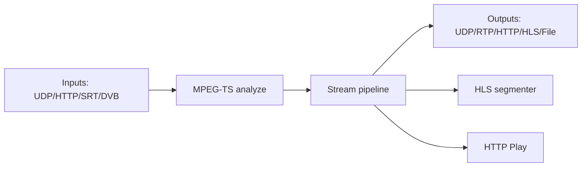

# Architecture

## Overview
Astral is a Linux-first IPTV streaming stack built around a C core with Lua-based
runtime scripts and a browser UI. The binary embeds Lua and loads modules for
HTTP, HLS, UDP, MPEG-TS analysis, and optional components (DVB, softcam, buffer).

## Major Components
- C core (`core/`): event loop, timers, sockets, threads, logging.
- Modules (`modules/`): protocol/feature implementations (http, hls, udp, mpegts,
  http_buffer, softcam, sqlite, etc.).
- Lua runtime (`scripts/`): API server, config store, stream runtime, auth,
  monitoring, buffer/hlssplitter orchestration.
- Web UI (`web/`): single-page app (index.html + app.js + styles.css).
- SQLite config store (`data/astra.db` by default): streams, adapters, settings,
  alerts, audit log, buffer/hlssplitter tables, config revisions.

## Processes
- Single main process (`./astra`) for API/UI + runtime management.
- Optional external process: `hlssplitter` (managed by Stream Hub if configured).
- Optional external processes: `ffmpeg` for transcode (spawned by runtime).

## Data Flow (Streams)
```
input -> analyze -> stream pipeline -> outputs -> HLS/HTTP Play (optional)
```

Mermaid view:


## Runtime Control
- `scripts/server.lua`: main entrypoint, HTTP server, loads runtime and API.
- `scripts/api.lua`: REST API, config apply/reload, settings, status endpoints.
- `scripts/stream.lua`: stream lifecycle, input/output creation, failover,
  HLS output defaults, stream-level validation.
- `scripts/runtime.lua`: status aggregation, metrics, sessions, monitoring hooks.

## Config Lifecycle
1. API `POST/PUT` writes config into SQLite via `scripts/config.lua`.
2. `scripts/api.lua` creates a config revision and snapshot.
3. Runtime reload applies changes (streams/adapters/buffer/splitter refresh).
4. On error, rollback to last known good snapshot (LKG).

## Auth, Sessions, Logs, Metrics
- Auth and sessions: `scripts/auth.lua` + `scripts/api.lua`.
- Logs: in-memory buffers with retention (`settings`), plus stdout/file logs.
- Metrics: `scripts/runtime.lua` exposes `/api/v1/metrics` and Prometheus output.
- Alerts: stored in SQLite table `alerts`, exposed by `/api/v1/alerts`.

## Storage
- Primary state: SQLite in `data/astra.db` (default).
- Snapshots: `data/backups/config/` (config revisions).
- HLS files: `data/hls/` by default, or custom `hls_dir`.

## External Interfaces
- HTTP API: `/api/v1/*`.
- UI: served from `--web-dir` via HTTP server.
- HTTP Play: playlist + stream endpoints.
- Optional: HLSSplitter and Buffer APIs for advanced distribution.

## Build/Modules
- `configure.sh` detects optional dependencies (libdvbcsa, libssl, libpq).
- Linux-only modules: `dvb`, `asi`.
- Optional: `biss_encrypt` requires `libdvbcsa`.
